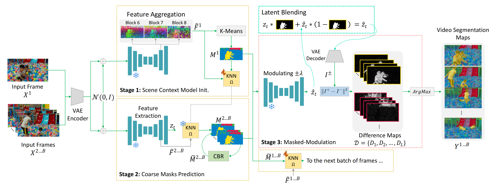

# :video_camera: Implementation of Zero-Shot Video Semantic Segmentation [CVPR 2025]
[](https://arxiv.org/abs/2405.16947)
:rocket: [Project page](https://qianwangx.github.io/VidSeg_diffusion/)


This is the implementation of **Zero-Shot Video Semantic Segmentation based on Pre-Trained Diffusion Models**.<br> 
This code base is modified based on the repo [generative-models](https://github.com/Stability-AI/generative-models). 

### Method


### Set up environment
Please create a conda environment.
```bash
conda create -n vidseg python=3.9
conda activate vidseg
pip install -r requirements/pt2.txt
```

Install `sgm`
```bash
pip install -e .
```

### Prepare checkpoints
Please download the checkpoint for SVD from [here](https://huggingface.co/stabilityai/stable-video-diffusion-img2vid) and SD 2.1 from [here](https://huggingface.co/stabilityai/stable-diffusion-2-1). Please put the checkpoints under folder `./checkpoints`. You can also change the location and modify `configs/inference/sd_2_1.yaml` or `configs/inference/svd.yaml`.

### Download dataset
Please download the dataset from official websites: [VSPW](https://github.com/VSPW-dataset/VSPW-dataset-download).

### Usage
SD on VSPW dataset:
```bash
python scripts/sampling/sd_pipeline_vspw.py --is_injected_features --num_masks 20 --feature_folder features_outputs_sd_vspw --is_refine_mask --is_aggre_attn --dataset_path YOUR_VSPW_DATASET_PATH --split_file_path YOUR_VSPW_VAL_SPLIT_FILE_PATH 
```

SVD on VSPW dataset:
```bash
python scripts/sampling/svd_pipeline_vspw.py --is_injected_features --num_masks 20 --feature_folder features_outputs_svd_vspw --is_refine_mask --is_aggre_attn --dataset_path YOUR_VSPW_DATASET_PATH --split_file_path YOUR_VSPW_VAL_SPLIT_FILE_PATH 
```

Single video inference:
```bash
python scripts/sampling/svd_single_video_inference.py --input_video_path "input_video/swan"  --exp_name="swan" --is_injected_features --is_refine_mask --is_aggre_attn --num_masks 5
```

Here, we enable latent blending by default. You can turn off it by adding `--disable_latent_blending`. We enable correspondence-based refinement by adding `--is_refine_mask` and feature aggregation by `--is_aggre_attn`. For single video inference, please change `exp_name` and `input_video_path` accordingly.

TODO:
- [x] Inference file for a single video
- [ ] Inference on Cityscapes and CamVid datasets

## Citations
```
@misc{wang2024zeroshot,
      title={Zero-Shot Video Semantic Segmentation based on Pre-Trained Diffusion Models}, 
      author={Qian Wang and Abdelrahman Eldesokey and Mohit Mendiratta and Fangneng Zhan and Adam Kortylewski and Christian Theobalt and Peter Wonka},
      year={2024},
      eprint={2405.16947},
      archivePrefix={arXiv},
      primaryClass={cs.CV}
}
```
